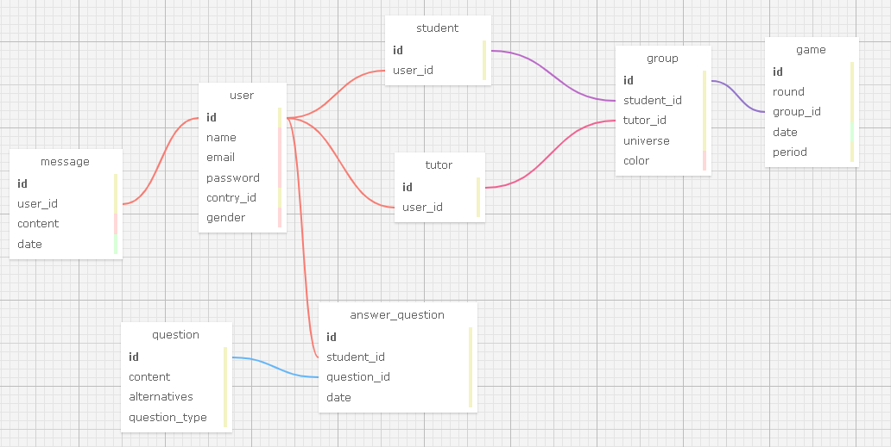

# modelagem-banco-de-dados

## Cardinalidade

A cardinalidade em um modelo de banco de dados descreve o número de entidades filhas que estão relacionadas a uma única entidade pai em uma relação. Existem três tipos principais de cardinalidade:

Um para Um (1:1): Cada entidade em uma tabela está associada a no máximo uma entidade na outra tabela e vice-versa.

Um para Muitos (1:N): Cada entidade em uma tabela pode estar associada a várias entidades na outra tabela, mas cada entidade nessa outra tabela está associada a no máximo uma entidade na primeira tabela.

Muitos para Muitos (N:N): Cada entidade em uma tabela pode estar associada a várias entidades na outra tabela e vice-versa.

## Chaves Primárias e Estrangeiras
As chaves primárias e estrangeiras são usadas para estabelecer e manter essas relações entre tabelas em um banco de dados relacional. Aqui está uma explicação de como elas são usadas no arquivo fornecido:

Chave Primária (Primary Key): Uma chave primária é uma coluna ou conjunto de colunas que identifica de forma exclusiva cada registro em uma tabela. Ela garante que não haja duplicatas e permite acesso rápido aos dados. No arquivo fornecido, a chave primária é identificada pela cláusula PRIMARY KEY.

Chave Estrangeira (Foreign Key): Uma chave estrangeira é uma coluna ou conjunto de colunas em uma tabela que estabelece uma relação com a chave primária de outra tabela. Ela cria um vínculo entre as duas tabelas e é usada para garantir a integridade referencial dos dados. No arquivo fornecido, as chaves estrangeiras são identificadas pela cláusula FOREIGN KEY, que especifica a relação entre as tabelas e as colunas envolvidas.



## Relações a imagem
Na imagem acima, várias tabelas são definidas juntamente com suas chaves primárias e estrangeiras. Aqui está um resumo das relações entre as tabelas:

game e group: A tabela game possui uma chave estrangeira group_id, que se relaciona com a chave primária id da tabela group. Isso sugere uma relação de um para muitos, onde um jogo pode pertencer a apenas um grupo, mas um grupo pode ter vários jogos.

group, tutor e student: As tabelas group, tutor e student têm relacionamentos entre si através das chaves estrangeiras student_id e tutor_id, que se relacionam com as chaves primárias id das respectivas tabelas. Isso indica que um grupo pode ter um tutor e vários alunos, e um aluno ou tutor pode pertencer a vários grupos.

message e user: A tabela message possui uma chave estrangeira user_id, que se relaciona com a chave primária id da tabela user. Isso sugere uma relação de um para muitos, onde um usuário pode enviar vários mensagens, mas cada mensagem pertence a apenas um usuário.

answer_question e user, question: A tabela answer_question possui chaves estrangeiras student_id e question_id, que se relacionam com as chaves primárias id das tabelas user e question, respectivamente. Isso sugere uma relação onde um usuário pode responder várias questões, e cada questão pode ter várias respostas de usuários diferentes.

## Codigo SQL
```
-- ---
-- Globals
-- ---

-- SET SQL_MODE="NO_AUTO_VALUE_ON_ZERO";
-- SET FOREIGN_KEY_CHECKS=0;

-- ---
-- Table 'game'
-- 
-- ---

DROP TABLE IF EXISTS `game`;
		
CREATE TABLE `game` (
  `id` INTEGER NULL AUTO_INCREMENT DEFAULT NULL,
  `round` INTEGER NULL DEFAULT NULL,
  `group_id` INTEGER NULL DEFAULT NULL,
  `date` DATE NULL DEFAULT NULL,
  `period` INTEGER NULL DEFAULT NULL,
  PRIMARY KEY (`id`)
);

-- ---
-- Table 'user'
-- 
-- ---

DROP TABLE IF EXISTS `user`;
		
CREATE TABLE `user` (
  `id` INTEGER NULL AUTO_INCREMENT DEFAULT NULL,
  `name` MEDIUMTEXT NULL DEFAULT NULL,
  `email` MEDIUMTEXT NULL DEFAULT NULL,
  `password` MEDIUMTEXT NULL DEFAULT NULL,
  `contry_id` INTEGER NULL DEFAULT NULL,
  `gender` MEDIUMTEXT NULL DEFAULT NULL,
  PRIMARY KEY (`id`)
);

-- ---
-- Table 'group'
-- 
-- ---

DROP TABLE IF EXISTS `group`;
		
CREATE TABLE `group` (
  `id` INTEGER NULL AUTO_INCREMENT DEFAULT NULL,
  `student_id` INTEGER NULL DEFAULT NULL,
  `tutor_id` INTEGER NULL DEFAULT NULL,
  `universe` INTEGER NULL DEFAULT NULL,
  `color` MEDIUMTEXT NULL DEFAULT NULL,
  PRIMARY KEY (`id`)
);

-- ---
-- Table 'message'
-- 
-- ---

DROP TABLE IF EXISTS `message`;
		
CREATE TABLE `message` (
  `id` INTEGER NULL AUTO_INCREMENT DEFAULT NULL,
  `user_id` INTEGER NULL DEFAULT NULL,
  `content` MEDIUMTEXT NULL DEFAULT NULL,
  `date` DATE NULL DEFAULT NULL,
  PRIMARY KEY (`id`)
);

-- ---
-- Table 'question'
-- 
-- ---

DROP TABLE IF EXISTS `question`;
		
CREATE TABLE `question` (
  `id` INTEGER NULL AUTO_INCREMENT DEFAULT NULL,
  `content` INTEGER NULL DEFAULT NULL,
  `alternatives` INTEGER NULL DEFAULT NULL,
  `question_type` INTEGER NULL DEFAULT NULL,
  PRIMARY KEY (`id`)
);

-- ---
-- Table 'tutor'
-- 
-- ---

DROP TABLE IF EXISTS `tutor`;
		
CREATE TABLE `tutor` (
  `id` INTEGER NULL AUTO_INCREMENT DEFAULT NULL,
  `user_id` INTEGER NULL DEFAULT NULL,
  PRIMARY KEY (`id`)
);

-- ---
-- Table 'student'
-- 
-- ---

DROP TABLE IF EXISTS `student`;
		
CREATE TABLE `student` (
  `id` INTEGER NULL AUTO_INCREMENT DEFAULT NULL,
  `user_id` INTEGER NULL DEFAULT NULL,
  PRIMARY KEY (`id`)
);

-- ---
-- Table 'answer_question'
-- 
-- ---

DROP TABLE IF EXISTS `answer_question`;
		
CREATE TABLE `answer_question` (
  `id` INTEGER NULL AUTO_INCREMENT DEFAULT NULL,
  `student_id` INTEGER NULL DEFAULT NULL,
  `question_id` INTEGER NULL DEFAULT NULL,
  `date` INTEGER NULL DEFAULT NULL,
  PRIMARY KEY (`id`)
);

-- ---
-- Foreign Keys 
-- ---

ALTER TABLE `game` ADD FOREIGN KEY (group_id) REFERENCES `group` (`id`);
ALTER TABLE `group` ADD FOREIGN KEY (student_id) REFERENCES `student` (`id`);
ALTER TABLE `group` ADD FOREIGN KEY (tutor_id) REFERENCES `tutor` (`id`);
ALTER TABLE `message` ADD FOREIGN KEY (user_id) REFERENCES `user` (`id`);
ALTER TABLE `tutor` ADD FOREIGN KEY (user_id) REFERENCES `user` (`id`);
ALTER TABLE `student` ADD FOREIGN KEY (user_id) REFERENCES `user` (`id`);
ALTER TABLE `answer_question` ADD FOREIGN KEY (student_id) REFERENCES `user` (`id`);
ALTER TABLE `answer_question` ADD FOREIGN KEY (question_id) REFERENCES `question` (`id`);

-- ---
-- Table Properties
-- ---

-- ALTER TABLE `game` ENGINE=InnoDB DEFAULT CHARSET=utf8 COLLATE=utf8_bin;
-- ALTER TABLE `user` ENGINE=InnoDB DEFAULT CHARSET=utf8 COLLATE=utf8_bin;
-- ALTER TABLE `group` ENGINE=InnoDB DEFAULT CHARSET=utf8 COLLATE=utf8_bin;
-- ALTER TABLE `message` ENGINE=InnoDB DEFAULT CHARSET=utf8 COLLATE=utf8_bin;
-- ALTER TABLE `question` ENGINE=InnoDB DEFAULT CHARSET=utf8 COLLATE=utf8_bin;
-- ALTER TABLE `tutor` ENGINE=InnoDB DEFAULT CHARSET=utf8 COLLATE=utf8_bin;
-- ALTER TABLE `student` ENGINE=InnoDB DEFAULT CHARSET=utf8 COLLATE=utf8_bin;
-- ALTER TABLE `answer_question` ENGINE=InnoDB DEFAULT CHARSET=utf8 COLLATE=utf8_bin;

-- ---
-- Test Data
-- ---

-- INSERT INTO `game` (`id`,`round`,`group_id`,`date`,`period`) VALUES
-- ('','','','','');
-- INSERT INTO `user` (`id`,`name`,`email`,`password`,`contry_id`,`gender`) VALUES
-- ('','','','','','');
-- INSERT INTO `group` (`id`,`student_id`,`tutor_id`,`universe`,`color`) VALUES
-- ('','','','','');
-- INSERT INTO `message` (`id`,`user_id`,`content`,`date`) VALUES
-- ('','','','');
-- INSERT INTO `question` (`id`,`content`,`alternatives`,`question_type`) VALUES
-- ('','','','');
-- INSERT INTO `tutor` (`id`,`user_id`) VALUES
-- ('','');
-- INSERT INTO `student` (`id`,`user_id`) VALUES
-- ('','');
-- INSERT INTO `answer_question` (`id`,`student_id`,`question_id`,`date`) VALUES
-- ('','','','');
